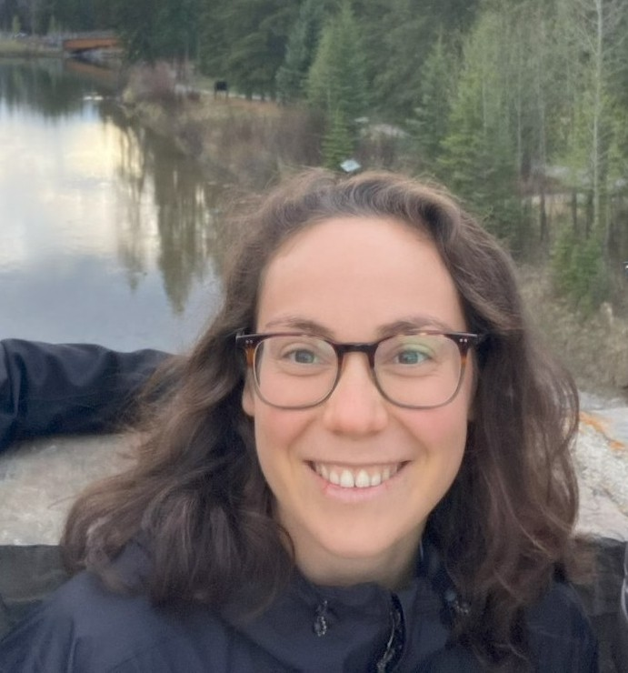

  

I am a mathematics PhD student at [UT Austin](https://math.utexas.edu/) working with [Nataša Pavlović](https://web.ma.utexas.edu/users/natasa/). 

I am interested in mathematical physics and probability. Right now, I particularly like to think about problems in wave turbulence. 

I am the currently the organizer of the [Junior Analysis Seminar](https://sites.utexas.edu/janal/).

Office: PMA 12.146
Email: [lmvelasco@utexas.edu](mailto:lmvelasco@utexas.edu)
